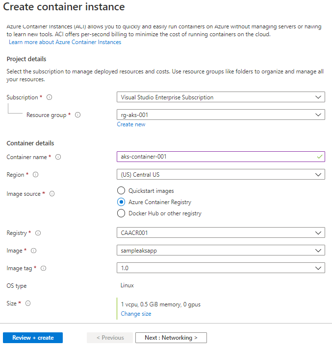
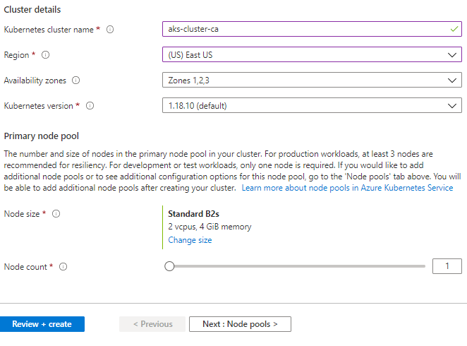
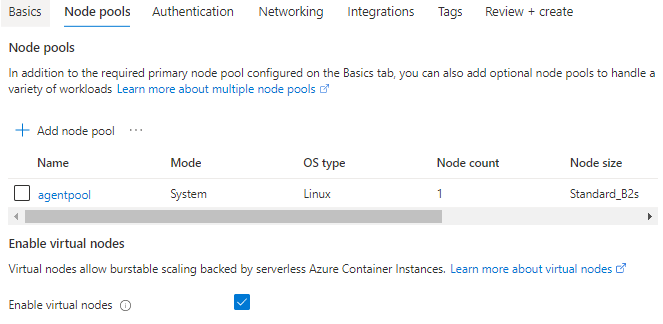

# Azure Kubernetes Service

## 1: Creating Container Instance on Azure using the Docker Image
1. Open Cloud Shell on Azure Portal.
2. Create a resource group in the portal or the CLI for the AKS resource.    
    `az group create --name rg-aks-001 --location eastus`
3. Create a Container Registry in the Azure Portal.     
    `az acr create --resource-group rg-aks-001 --name #ACRName --sku Basic --admin-enabled`
4. Clone this Git Repo on the Azure Cloud Shell.    
    `git clone https://github.com/wiservarun/work-with-aks`
5. Navigate to the root folder.    
    `cd work-with-aks/SampleAKSApp`
6. Build the Docker Image for the web app and push it to the ACR.    
    `az acr build --registry #ACRName --image sampleaksapp:1.0 .`
7. Create an Azure Container Instance in the portal using the image built in the previosu step. 
    Search Container Instance in the Add Resource. Select networking type as Public with a unique DNS label. This will create an new Public IP for the container instance. 
    
    
8. Access the FQDN URL created for your container instance in format.</br>
    `http://<DNS Label>.<Region>.azurecontainer.io`
    
## 2: Getting Started with AKS  
1. Create your AKS cluster on the Azure Portal in the same resource group. 
    </br>A. Choose below configurations for lesser cost or configuration of your choice. 
       </br>
    </br>B. Please make sure to enable Virtual Nodes under the Node Pools tab. 
       </br> 
    </br>C. Use Authentication method as "System-assigned managed Identity" in the Authentication tab.
    </br>D. Select the Container Registry created earlier in the Integrations tab.
 2. Navigate to the SampleAKSConsole folder that ontains a sample console app.
      `cd SampleAKSConsole`
 3. Set below variables (to be used in CLI commands).
```
      AKS_Name=aks-cluster-ca
      ACR_Name=CAACR001
      RG_Name=rg-aks-001
      REGION=eastus
 ```      
4. Build the Docker Image for the colsole app and push it to the ACR.   
    `az acr build --registry $ACR_Name --image sampleaksconsole:1.0 .`
5. Attach the ACR to the AKS Cluster
    </br> `az aks update -n $AKS_Name -g $RG_Name --attach-acr $(az acr show -n $ACR_Name --query "id" -o tsv)`
6. Connect to AKS Cluster
    </br> `az aks get-credentials --resource-group $RG_Name --name $AKS_Name`
7. Open ca-console-pod.yaml on the Azure PowerShell and provide the image name with the ACR name.
8. Deploy sampleaksconsole Pod from the manifest file.
     </br>`kubectl create -f ./ca-console-pod.yaml`

## 3: Deploying AKS Service and Load balancer
1. Navigate to the SampleAKSApp folder of the repo.
2. Open ca-lb-deploy.yaml on the Azure PowerShell and provide the image name with the ACR name.
3. Deploy the service.
    </br> `kubectl create -f k8s-deploy.yaml`
4. Check the service and the deployment resources. 
    </br> `kubectl get all`
          `kubectl get svc`
5. Open the Public IP of the service on the browser. (It make take a couple of minutes for the public IP to provision).
